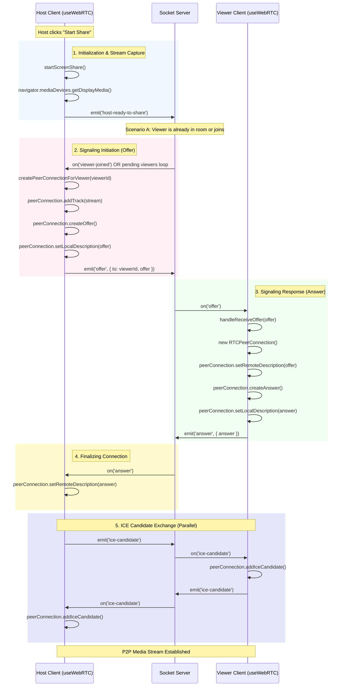

# RTC and Socket Workflow Analysis

This document explains the workflow between `useSocket` and `useWebRTC` hooks, detailing how the Real-Time Communication (RTC) is established and managed.

## Overview

- **`useSocket`**: Manages the persistent WebSocket connection (Socket.IO) for signaling, chat, and room management. It acts as the transport layer for WebRTC signaling messages (offers, answers, ICE candidates).
- **`useWebRTC`**: Manages the `RTCPeerConnection` lifecycle, media streams (screen sharing), and the specific WebRTC signaling logic.

## Workflow Diagram

The following Mermaid diagram illustrates the sequence of events when a Host starts screen sharing and a Viewer connects.

## Key Functions in `useWebRTC`

### Host Side Functions

1.  **`startScreenShare()`**
    *   **Purpose**: Initiates the screen sharing session.
    *   **Logic**:
        *   Calls `navigator.mediaDevices.getDisplayMedia` to capture the screen.
        *   Sets the `localStream` state.
        *   Iterates through `pendingViewersRef` (viewers who joined before sharing started) and calls `createPeerConnectionForViewer` for each.
        *   Emits `host-ready-to-share` to the server.

2.  **`createPeerConnectionForViewer(viewerId, stream)`**
    *   **Purpose**: Creates and configures a new WebRTC connection for a specific viewer.
    *   **Logic**:
        *   Creates a new `RTCPeerConnection`.
        *   Adds the screen share tracks to the connection.
        *   Sets up event listeners for `onicecandidate` (to send candidates to this specific viewer) and connection state changes.
        *   Creates an **Offer** (`createOffer`), sets it as the Local Description, and emits it via socket (`emit('offer')`).

3.  **`socket.on('viewer-joined')`**
    *   **Purpose**: Handles new viewers joining the room.
    *   **Logic**:
        *   If the host is already sharing (`localStreamRef.current` exists), it immediately calls `createPeerConnectionForViewer`.
        *   If not sharing, it adds the viewer ID to `pendingViewersRef` to be handled later when sharing starts.

4.  **`socket.on('answer')`**
    *   **Purpose**: Completes the signaling handshake.
    *   **Logic**:
        *   Retrieves the correct `RTCPeerConnection` for the sender.
        *   Calls `setRemoteDescription` with the received answer.

### Viewer Side Functions

1.  **`handleReceiveOffer(offer)`**
    *   **Purpose**: Responds to the Host's invitation to connect.
    *   **Logic**:
        *   Closes any existing peer connection to ensure a clean state.
        *   Creates a new `RTCPeerConnection`.
        *   Sets up `ontrack` to receive the remote media stream (`setRemoteStream`).
        *   Sets the **Remote Description** to the received offer.
        *   Creates an **Answer** (`createAnswer`), sets it as Local Description, and emits it via socket (`emit('answer')`).
        *   Processes any ICE candidates that might have arrived before the offer (queued in `iceCandidatesQueueRef`).

2.  **`socket.on('ice-candidate')`**
    *   **Purpose**: Handles network path discovery candidates.
    *   **Logic**:
        *   If the `remoteDescription` is already set, it adds the candidate immediately (`addIceCandidate`).
        *   If not, it queues the candidate to be added later (to avoid "Remote description not set" errors).

3.  **`socket.on('host-reconnected')`**
    *   **Purpose**: Handles recovery if the host disconnects and reconnects.
    *   **Logic**:
        *   Resets the WebRTC state (closes connections, clears stream).
        *   Emits `request-stream` to ask the host to re-initiate the connection.

## Data Flow Summary

1.  **Signaling Transport**: `useSocket` provides the `socket` instance. All `socket.emit` and `socket.on` calls in `useWebRTC` use this instance to pass JSON messages (SDP offers/answers, ICE candidates) through the server.
2.  **Media Transport**: Once the signaling is complete (Offer/Answer exchanged) and ICE candidates are processed, the browser establishes a direct Peer-to-Peer (P2P) connection (or via TURN relay) to transmit the actual video/audio stream. This bypasses the Socket.IO server.
