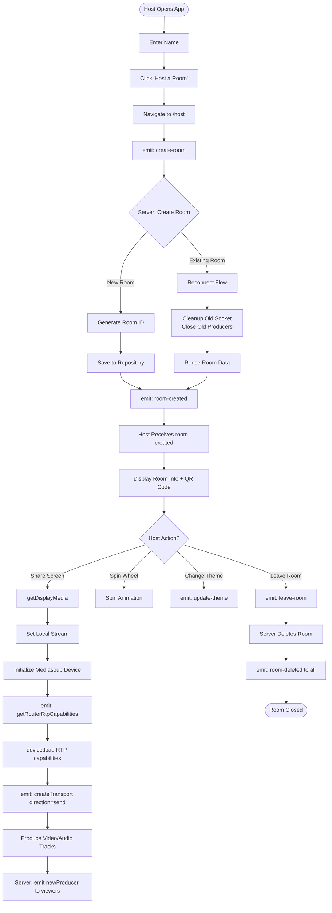
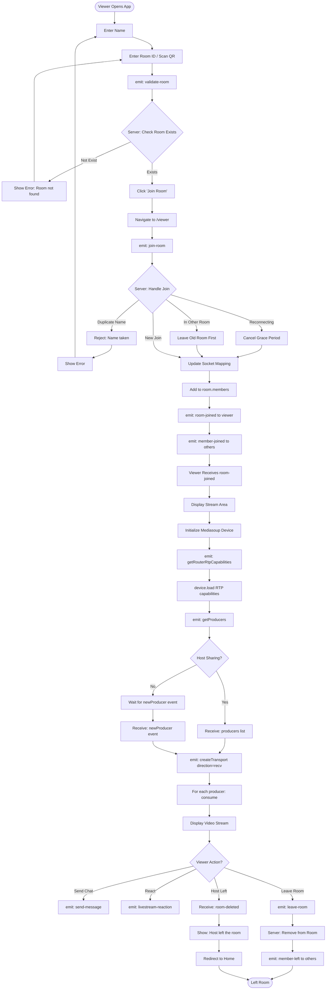
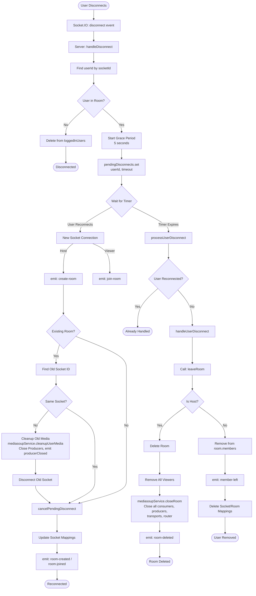
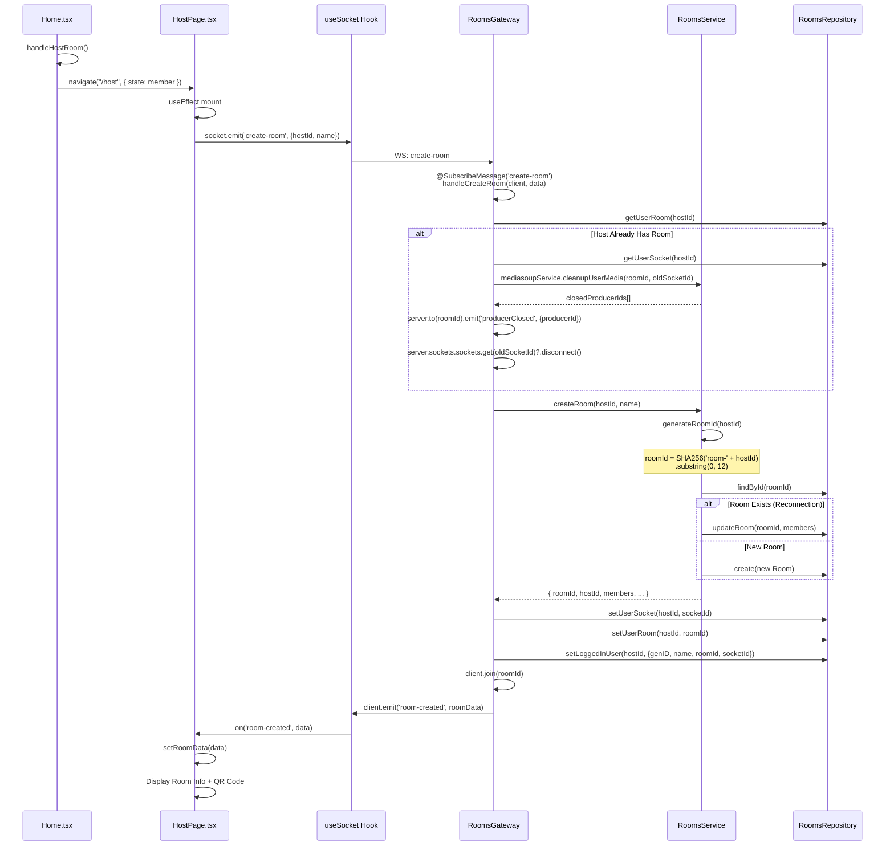
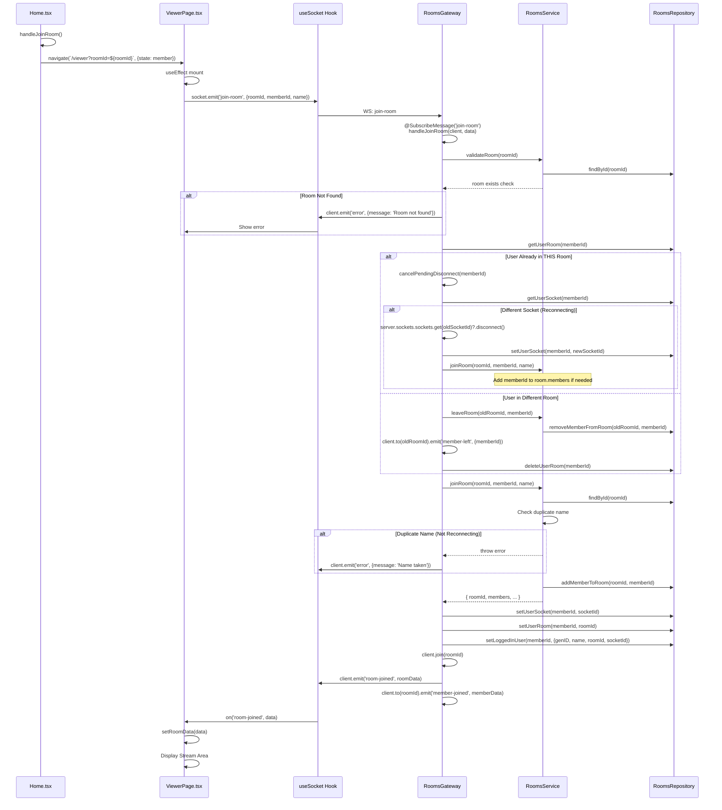
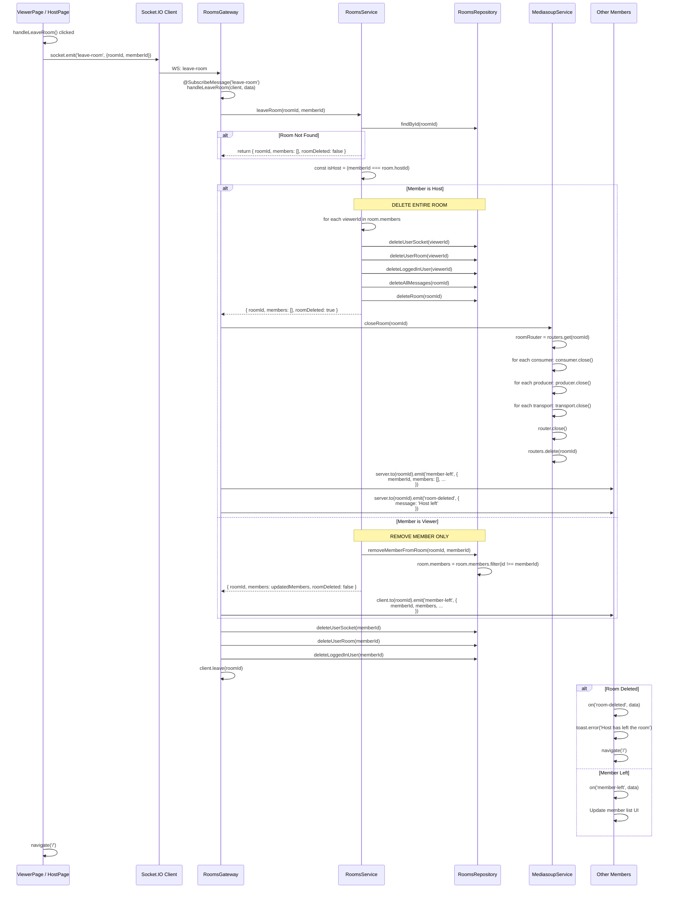

## 3. USER FLOW DIAGRAMS
### 3.1 Host Creates Room & Starts Sharing (Mediasoup)

### 3.2 Viewer Joins Room & Watches Stream (Mediasoup)

### 3.3 Mediasoup Screen Sharing Flow (Detailed)

```mermaid
flowchart TD
    Start([Host Starts Sharing]) --> GetDisplay[navigator.mediaDevices<br/>.getDisplayMedia]
    GetDisplay --> SetLocal[localStreamRef.current = stream<br/>setLocalStream, setIsSharing=true]

    SetLocal --> CheckDevice{Device Ready?}
    CheckDevice -->|No| GetRtp[emit: getRouterRtpCapabilities]
    GetRtp --> ServerRtp[Server: createRouter if needed]
    ServerRtp --> ReceiveRtp[Receive: routerRtpCapabilities]
    ReceiveRtp --> LoadDevice[device = new Device<br/>device.load rtpCapabilities]

    CheckDevice -->|Yes| CreateTransport
    LoadDevice --> CreateTransport[emit: createTransport<br/>direction: send]

    CreateTransport --> ServerTransport[Server: router.createWebRtcTransport<br/>transportId = socketId-send]
    ServerTransport --> ReceiveParams[Receive: transportCreated<br/>iceParameters, dtlsParameters]
    ReceiveParams --> DeviceTransport[device.createSendTransport]

    DeviceTransport --> SetupListeners[Setup transport listeners:<br/>on connect, on produce]
    SetupListeners --> ProduceTrack[sendTransport.produce track]

    ProduceTrack --> OnConnect[Event: transport.on connect]
    OnConnect --> EmitConnect[emit: connectTransport<br/>dtlsParameters]
    EmitConnect --> ServerConnect[Server: transport.connect]
    ServerConnect --> ConnectCallback[callback - connected]

    ConnectCallback --> OnProduce[Event: transport.on produce]
    OnProduce --> EmitProduce[emit: produce<br/>kind, rtpParameters]
    EmitProduce --> ServerProduce[Server: transport.produce]
    ServerProduce --> SaveProducer[roomRouter.producers.set<br/>producer.id, producer]
    SaveProducer --> ReceiveProduced[Receive: produced<br/>producerId]
    ReceiveProduced --> ProduceCallback[callback producerId]
    ProduceCallback --> StoreProducer[producersRef.set kind, producer]

    StoreProducer --> BroadcastNew[Server: emit newProducer<br/>to all viewers in room]

    BroadcastNew --> ViewerReceive[Viewer: on newProducer]
    ViewerReceive --> ViewerCheckDevice{Viewer Device Ready?}

    ViewerCheckDevice -->|No| ViewerGetRtp[Viewer: getRouterRtpCapabilities]
    ViewerGetRtp --> ViewerLoadDevice[Viewer: device.load]

    ViewerCheckDevice -->|Yes| ViewerCheckTransport{Has RecvTransport?}
    ViewerLoadDevice --> ViewerCheckTransport

    ViewerCheckTransport -->|No| ViewerCreateTransport[Viewer: createTransport<br/>direction: recv]
    ViewerCreateTransport --> ViewerServerTransport[Server: createWebRtcTransport<br/>socketId-recv]
    ViewerServerTransport --> ViewerReceiveParams[Viewer: transportCreated]
    ViewerReceiveParams --> ViewerDeviceTransport[Viewer: device.createRecvTransport]

    ViewerCheckTransport -->|Yes| EmitConsume[Viewer: emit consume<br/>producerId, rtpCapabilities]
    ViewerDeviceTransport --> EmitConsume

    EmitConsume --> ServerConsume[Server: router.canConsume check<br/>transport.consume paused=true]
    ServerConsume --> SaveConsumer[roomRouter.consumers.set<br/>consumer.id, consumer]
    SaveConsumer --> ReceiveConsumed[Viewer: consumed event<br/>id, producerId, kind, rtpParameters]
    ReceiveConsumed --> DeviceConsume[Viewer: recvTransport.consume]
    DeviceConsume --> StoreConsumer[consumersRef.set consumerId]
    StoreConsumer --> AddTrack[Add consumer.track to remoteStream]
    AddTrack --> EmitResume[Viewer: emit resumeConsumer]
    EmitResume --> ServerResume[Server: consumer.resume]
    ServerResume --> GetTrack[Viewer: setRemoteStream]
    GetTrack --> ShowVideo[Viewer: video displays]

    ShowVideo --> End([Streaming Active])
```

### 3.4 Disconnect & Reconnection Flow

---

## 4. TECHNICAL FLOW - METHOD CALLS

### 4.1 Host Creates Room - Complete Method Call Sequence

### 4.2 Viewer Joins Room - Complete Method Call Sequence

### 4.3 Host Starts Screen Share (Mediasoup) - Complete Sequence

```mermaid
sequenceDiagram
    participant HostPage as HostPage.tsx
    participant Hook as useMediasoupWebRTC
    participant Socket as Socket.IO Client
    participant Server as RoomsGateway
    participant Mediasoup as MediasoupService
    participant Worker as Mediasoup Worker
    participant ViewerPage as ViewerPage.tsx
    participant ViewerHook as Viewer: useMediasoupWebRTC

    Note over HostPage,Worker: PHASE 1: INITIALIZATION

    HostPage->>Hook: startScreenShare() called
    Hook->>Hook: navigator.mediaDevices.getDisplayMedia()
    Hook->>Hook: localStreamRef.current = stream
    Hook->>Hook: setLocalStream(stream), setIsSharing(true)
    Hook->>Socket: socket.emit('getRouterRtpCapabilities', {roomId})

    Socket->>Server: WS: getRouterRtpCapabilities
    Server->>Server: handleGetRouterRtpCapabilities()
    Server->>Mediasoup: createRouter(roomId)

    alt Router Doesn't Exist
        Mediasoup->>Worker: worker.createRouter({ mediaCodecs })
        Worker-->>Mediasoup: router
        Mediasoup->>Mediasoup: routers.set(roomId, {<br/>  router, transports, producers, consumers<br/>})
    end

    Mediasoup-->>Server: routerRtpCapabilities
    Server->>Socket: client.emit('routerRtpCapabilities', data)
    Socket->>Hook: on('routerRtpCapabilities', data)
    Hook->>Hook: const device = new Device()
    Hook->>Hook: await device.load({ routerRtpCapabilities })
    Hook->>Hook: deviceRef.current = device

    Note over HostPage,Worker: PHASE 2: CREATE SEND TRANSPORT

    Hook->>Socket: socket.emit('createTransport', {roomId, direction: 'send'})
    Socket->>Server: WS: createTransport
    Server->>Server: handleCreateTransport(client, data)
    Server->>Mediasoup: createWebRtcTransport(roomId, transportId)

    Mediasoup->>Mediasoup: transportId = `${socketId}-send`
    Mediasoup->>Worker: router.createWebRtcTransport({<br/>  listenIps, enableUdp, enableTcp, ...<br/>})
    Worker-->>Mediasoup: transport
    Mediasoup->>Mediasoup: roomRouter.transports.set(transportId, transport)
    Mediasoup-->>Server: { id, iceParameters, iceCandidates, dtlsParameters }

    Server->>Socket: client.emit('transportCreated', {<br/>  direction: 'send', transportId, ...params<br/>})
    Socket->>Hook: on('transportCreated', data)
    Hook->>Hook: device.createSendTransport(params)
    Hook->>Hook: sendTransportRef.current = transport
    Hook->>Hook: sendTransportIdRef.current = data.transportId

    Hook->>Hook: transport.on('connect', ({dtlsParameters}, callback) => {<br/>  emit('connectTransport')<br/>})
    Hook->>Hook: transport.on('produce', ({kind, rtpParameters}, callback) => {<br/>  emit('produce')<br/>})

    Note over HostPage,Worker: PHASE 3: PRODUCE MEDIA

    Hook->>Hook: await produceMedia(localStream)
    Hook->>Hook: sendTransport.produce({ track: videoTrack })
    Note over Hook: This triggers 'connect' event first

    Hook->>Socket: socket.emit('connectTransport', {<br/>  roomId, transportId, dtlsParameters<br/>})
    Socket->>Server: WS: connectTransport
    Server->>Server: handleConnectTransport()
    Server->>Mediasoup: connectTransport(roomId, transportId, dtlsParameters)
    Mediasoup->>Mediasoup: transport = roomRouter.transports.get(transportId)
    Mediasoup->>Worker: await transport.connect({ dtlsParameters })
    Worker-->>Mediasoup: connected
    Mediasoup-->>Server: success
    Server->>Socket: client.emit('transportConnected', {transportId})
    Socket->>Hook: callback() in 'connect' handler

    Note over Hook: After transport connected, 'produce' event fires

    Hook->>Socket: socket.emit('produce', {<br/>  roomId, transportId, kind, rtpParameters<br/>})
    Socket->>Server: WS: produce
    Server->>Server: handleProduce(client, data)
    Server->>Mediasoup: produce(roomId, transportId, kind, rtpParameters)

    Mediasoup->>Mediasoup: transport = roomRouter.transports.get(transportId)
    Mediasoup->>Worker: producer = await transport.produce({<br/>  kind, rtpParameters<br/>})
    Worker-->>Mediasoup: producer (id, kind, rtpParameters)
    Mediasoup->>Mediasoup: roomRouter.producers.set(producer.id, producer)
    Mediasoup-->>Server: producer.id

    Server->>Socket: client.emit('produced', {kind, id: producer.id})
    Socket->>Hook: callback(producer.id) in 'produce' handler
    Hook->>Hook: producersRef.current.set(kind, producer)

    Server->>ViewerPage: server.to(roomId).emit('newProducer', {<br/>  producerId, kind<br/>})

    Note over HostPage,Worker: PHASE 4: VIEWER CONSUMES

    ViewerPage->>ViewerHook: on('newProducer', {producerId, kind})

    alt Viewer Doesn't Have RecvTransport
        ViewerHook->>Socket: socket.emit('createTransport', {<br/>  roomId, direction: 'recv'<br/>})
        Socket->>Server: WS: createTransport
        Server->>Mediasoup: createWebRtcTransport(roomId, `${viewerSocketId}-recv`)
        Mediasoup->>Worker: router.createWebRtcTransport(...)
        Worker-->>Mediasoup: recvTransport
        Server->>Socket: client.emit('transportCreated', {<br/>  direction: 'recv', ...<br/>})
        Socket->>ViewerHook: device.createRecvTransport(params)
        ViewerHook->>ViewerHook: recvTransportRef.current = transport
        ViewerHook->>ViewerHook: recvTransportIdRef.current = data.transportId
    end

    ViewerHook->>Socket: socket.emit('consume', {<br/>  roomId, transportId, producerId, rtpCapabilities<br/>})
    Socket->>Server: WS: consume
    Server->>Server: handleConsume(client, data)
    Server->>Mediasoup: consume(roomId, transportId, producerId, rtpCapabilities)

    Mediasoup->>Mediasoup: router.canConsume({ producerId, rtpCapabilities })

    alt Can't Consume
        Mediasoup-->>Server: throw error
        Server->>Socket: client.emit('error', {message})
    end

    Mediasoup->>Mediasoup: transport = roomRouter.transports.get(transportId)
    Mediasoup->>Worker: consumer = await transport.consume({<br/>  producerId, rtpCapabilities, paused: true<br/>})
    Worker-->>Mediasoup: consumer (id, producerId, kind, rtpParameters)
    Mediasoup->>Mediasoup: roomRouter.consumers.set(consumer.id, consumer)
    Mediasoup-->>Server: { id, producerId, kind, rtpParameters }

    Server->>Socket: client.emit('consumed', {<br/>  id, producerId, kind, rtpParameters<br/>})
    Socket->>ViewerHook: on('consumed', data)
    ViewerHook->>ViewerHook: consumer = await recvTransport.consume(params)
    ViewerHook->>ViewerHook: consumersRef.current.set(data.id, consumer)
    ViewerHook->>ViewerHook: Add consumer.track to remoteStream
    ViewerHook->>ViewerHook: setRemoteStream(stream)

    ViewerHook->>Socket: socket.emit('resumeConsumer', {<br/>  roomId, consumerId<br/>})
    Socket->>Server: WS: resumeConsumer
    Server->>Mediasoup: resumeConsumer(roomId, consumerId)
    Mediasoup->>Worker: consumer.resume()
    Worker-->>Mediasoup: resumed
    Server->>Socket: client.emit('consumerResumed', {consumerId})

    ViewerHook->>ViewerPage: Video displays in <video srcObject={remoteStream} />
```

### 4.4 Leave Room - Complete Method Call Sequence

### 4.5 Disconnect & Grace Period - Complete Sequence

```mermaid
sequenceDiagram
    participant Browser as Browser
    participant Socket as Socket.IO
    participant Server as RoomsGateway
    participant Repo as RoomsRepository
    participant Service as RoomsService
    participant Mediasoup as MediasoupService

    Note over Browser,Mediasoup: USER DISCONNECTS (Network issue / Page close)

    Browser->>Socket: Connection lost
    Socket->>Server: disconnect event
    Server->>Server: handleDisconnect(client)
    Server->>Repo: getUserIdBySocketId(client.id)

    alt User Not Found
        Server->>Server: return (no action)
    end

    Server->>Repo: getUserRoom(userId)

    alt User Not in Room
        Server->>Repo: deleteLoggedInUser(userId)
        Server->>Server: return
    end

    Server->>Server: const timeoutId = setTimeout(() => {<br/>  processUserDisconnect(userId, roomId)<br/>}, 5000)
    Server->>Server: pendingDisconnects.set(userId, timeoutId)
    Note over Server: GRACE PERIOD: 5 seconds

    alt SCENARIO A: User Reconnects Within 5 Seconds
        Browser->>Socket: Reconnect (new connection)
        Socket->>Server: New socket connected
        Browser->>Server: emit('create-room') or emit('join-room')

        Server->>Server: handleCreateRoom / handleJoinRoom
        Server->>Repo: getUserRoom(userId)
        Note over Server: Existing room found!

        Server->>Repo: getUserSocket(userId)
        Note over Server: oldSocketId found

        alt Old Socket != New Socket (Reconnection)
            Server->>Server: cancelPendingDisconnect(userId)
            Server->>Server: const timeoutId = pendingDisconnects.get(userId)
            Server->>Server: clearTimeout(timeoutId)
            Server->>Server: pendingDisconnects.delete(userId)
            Note over Server: GRACE PERIOD CANCELLED

            alt User is Host
                Server->>Mediasoup: cleanupUserMedia(roomId, oldSocketId)
                Note over Mediasoup: Close producers for old socket<br/>transports.forEach((t) => {<br/>  if (t.id.startsWith(oldSocketId)) close()<br/>})
                Server->>Server: server.to(roomId).emit('producerClosed', {producerId})
            end

            Server->>Server: server.sockets.sockets.get(oldSocketId)?.disconnect()
            Server->>Repo: setUserSocket(userId, newSocketId)
            Server->>Socket: emit('room-created') or emit('room-joined')
            Note over Server,Socket: USER SUCCESSFULLY RECONNECTED
        end
    end

    alt SCENARIO B: Grace Period Expires (5 seconds passed)
        Server->>Server: setTimeout callback fires
        Server->>Server: processUserDisconnect(userId, roomId)
        Server->>Repo: getUserSocket(userId)

        alt User Already Reconnected (Different Socket)
            Note over Server: User reconnected with different socket,<br/>already handled
            Server->>Server: pendingDisconnects.delete(userId)
            Server->>Server: return
        end

        Server->>Server: handleUserDisconnect(userId, roomId, 'disconnected')
        Server->>Service: leaveRoom(roomId, userId)

        alt User is Host
            Note over Service: Delete entire room
            Service->>Repo: for each member: deleteUserSocket,<br/>deleteUserRoom, deleteLoggedInUser
            Service->>Repo: deleteAllMessages(roomId)
            Service->>Repo: deleteRoom(roomId)
            Service-->>Server: { roomDeleted: true }

            Server->>Mediasoup: closeRoom(roomId)
            Mediasoup->>Mediasoup: Close all consumers, producers,<br/>transports, router

            Server->>Server: server.to(roomId).emit('member-left', {<br/>  userId, members: []<br/>})
            Server->>Server: server.to(roomId).emit('room-deleted', {<br/>  message: 'Host disconnected'<br/>})

        else User is Viewer
            Note over Service: Remove member from room
            Service->>Repo: removeMemberFromRoom(roomId, userId)
            Service-->>Server: { members: updatedMembers }

            Server->>Server: client.to(roomId).emit('member-left', {<br/>  userId, members<br/>})
        end

        Server->>Repo: deleteUserSocket(userId)
        Server->>Repo: deleteUserRoom(userId)
        Server->>Repo: deleteLoggedInUser(userId)
        Server->>Server: pendingDisconnects.delete(userId)

        Note over Server: USER DISCONNECTED PERMANENTLY
    end
```

